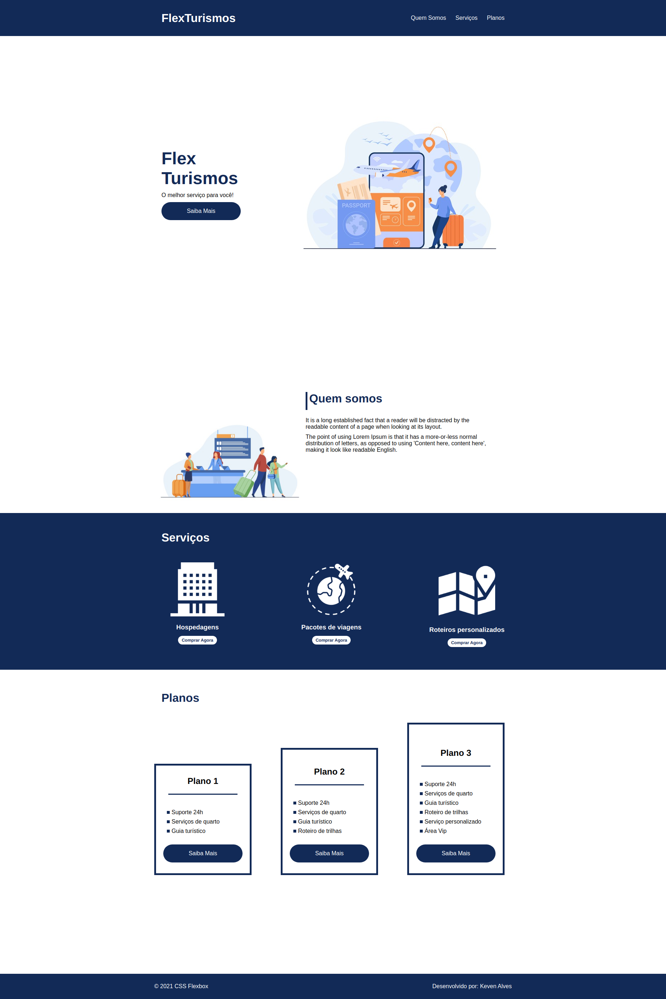

# Bootcamp - Impulso React Web Developer

  

## 🚀 Descrição
Projeto final da sessão do curso de CSS-Flexbox.
Verifique o projeto de forma interativa: https://landpageflex.netlify.app/

## 🔧 Melhorias e alteções no projeto proposto:
  - Construção de variaveis no CSS.
  - Alteração no posicionamento de alguns elementos.
  - Construção da responsividade para Mobile.
  - Adição de efeitos hover em todos os elementos do projeto

## 🖥️ preview final do projeto

  

## 📳 preview final do projeto mobile

  

