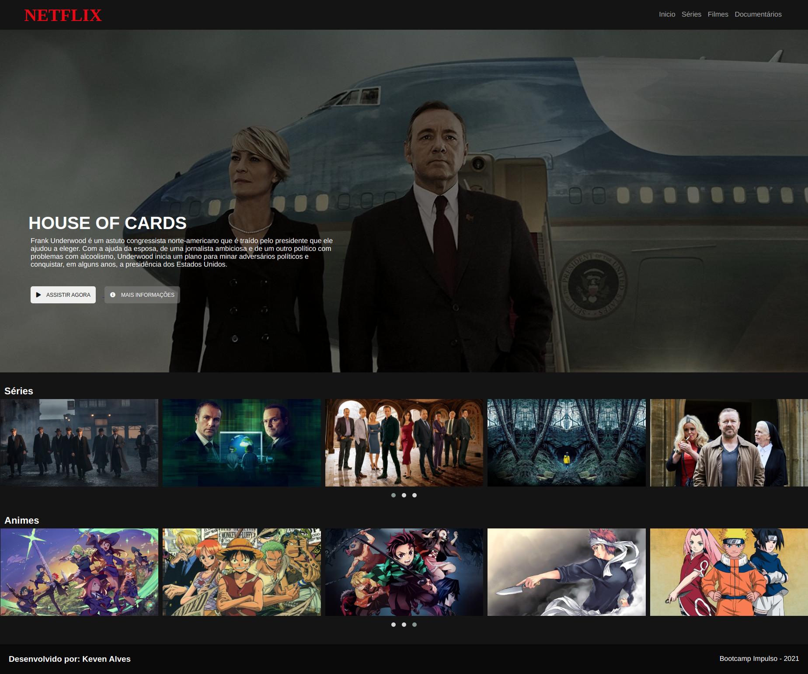
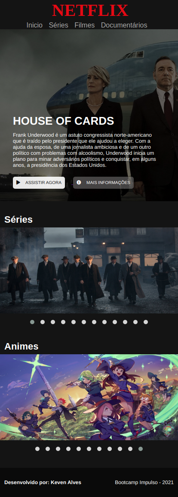

# Bootcamp - Impulso React Web Developer

  

## 🚀 Descrição
Projeto de fixação em Html5, CSS3, Javascript e bibliotecas.
Verifique o projeto de forma interativa: https://netflix-interfaceclone.netlify.app/

## 🔧 Melhorias e alteções feitas no projeto proposto:
  - Efeito hover nos cards do carrosel.
  - Adição do nome da série junto ao efeito hover e link direto para a paǵina oficial da mesma.
  - Construção da responsividade para Mobile.
  - Leve alteração do layout para se parecer mais com a Netflix atual.

## 🖥️ preview final do projeto

  

## 📳 preview final do projeto mobile

  

