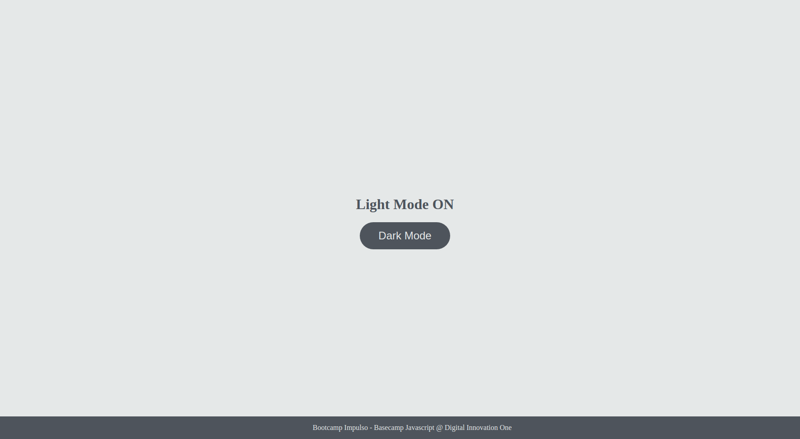
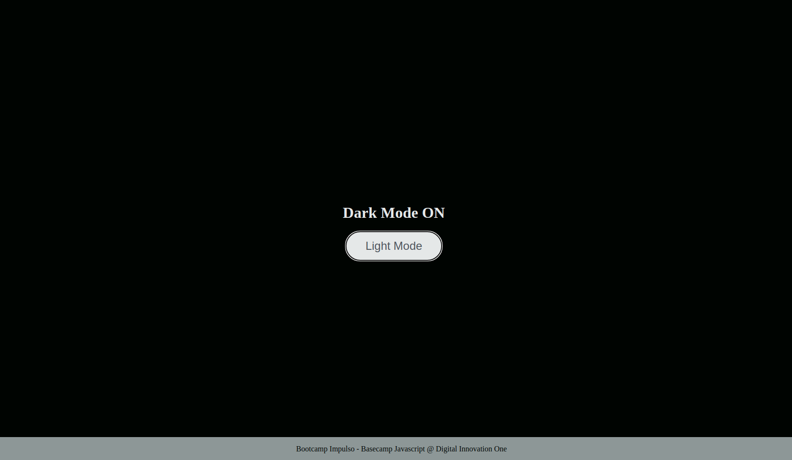

# Bootcamp - Impulso React Web Developer

  

## 🚀 Descrição
Projeto de consolidação da base de conhecimento na manipulação da DOM.  
Verifique o projeto de forma interativa: https://darkmode-dio.netlify.app/

## 🖥️ preview final do projeto versão Light Mode

  

## 📳 preview final do projeto versão Dark Mode

  

