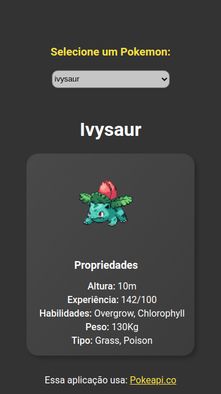

# GetPokemon - Live DIO - Trabalhando com classes em Javascript

Esse repositório foi criado para o projeto da Live do Bootcamp Impulso React Web Developer da Digital Innovation One.  \

  

Veja o projeto GetPokemon de forma interativa - [Visite](https://get-pokemon-kev.netlify.app/)

---

## 📚 Assuntos tratados na Live

* Definição de classe
* Instanciando uma classe
* Métodos `set` e `get`
* Hosting
* Modo Strict
* Propriedades e Métodos Static
* Extends

---

## 🔧 Mudanças implementadas

* Adição da propriedade Peso
* Adição da propriedade Tipo
* Altereção no design
* Refatoração de CSS para SCSS

---

## 📳 preview final do projeto mobile

  

