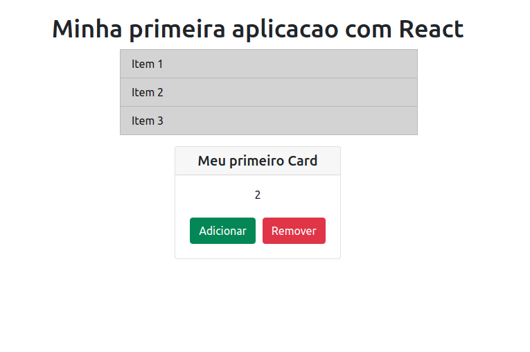

# Bootcamp - Impulso React Web Developer

  

## 🚀 Descrição
Primeiro exercicio sobre componentes no React.

## 🔧 Melhorias e alteções no projeto:
  - Construção da estilização do projeto
  - Mudança de posicionamento
  - criação e importação de arquivos css

## 🖥️ preview final do projeto

  

