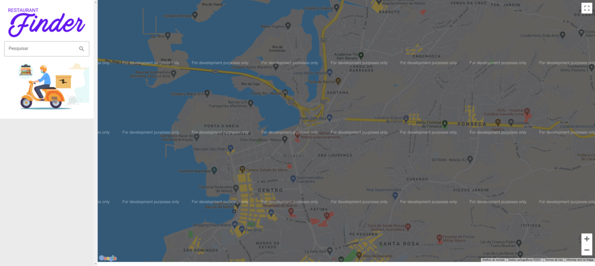

# Bootcamp - Impulso React Web Developer

  

## 🚀 Descrição
Projeto final do Bootcamp Impulso React Web Developer desenvolvido utilizando React e consumindo as API'S do Google, Google Map e Google Finder.

Ao baixar o projeto o mapa vai estar inoperante, para colocá-lo em funcionamento será necessário criar um arquivo .env na raiz do projeto e atribuir uma váriavel de ambiente.
Para isto basta colar: REACT_APP_GOOGLE_API_KEY= Sua Chave das duas APIS aqui.

## 🖥️ preview final do projeto

  

